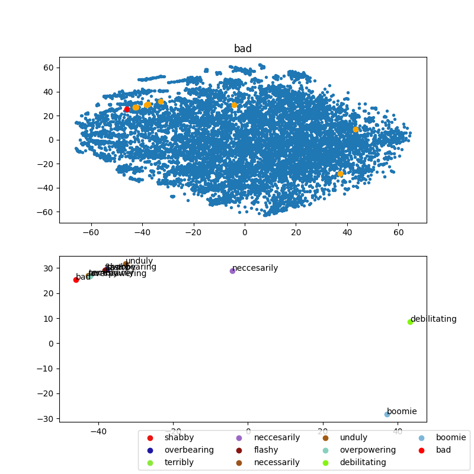
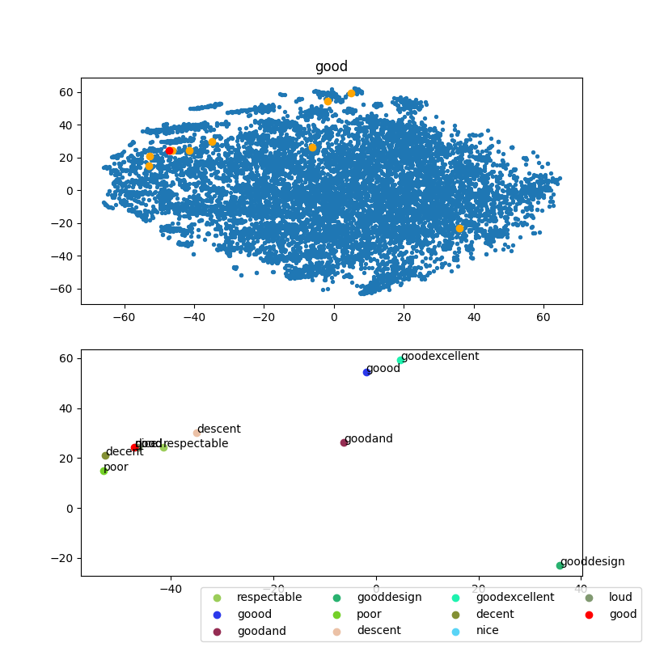
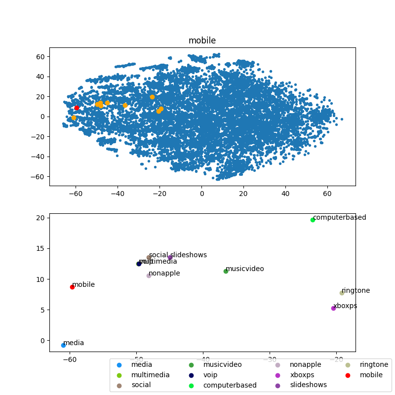
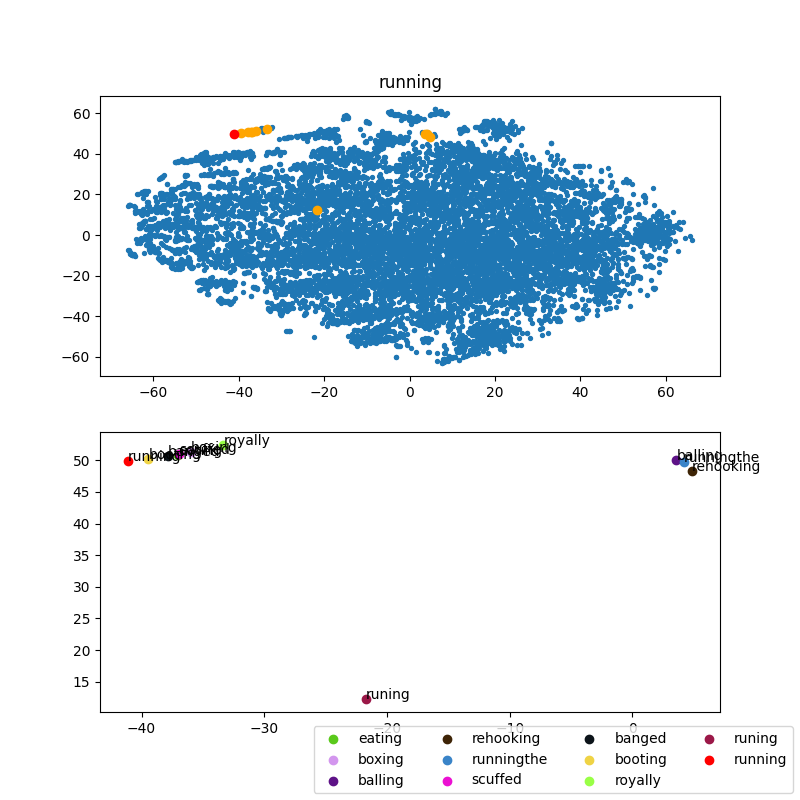
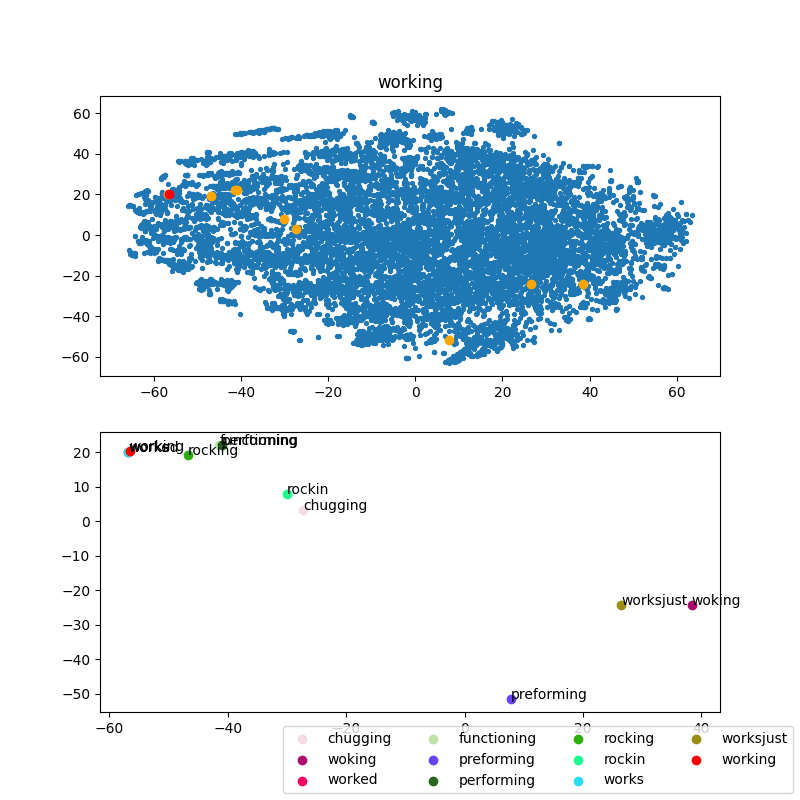
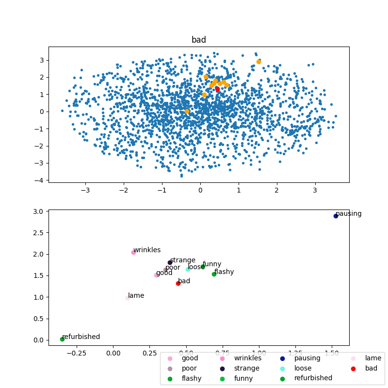
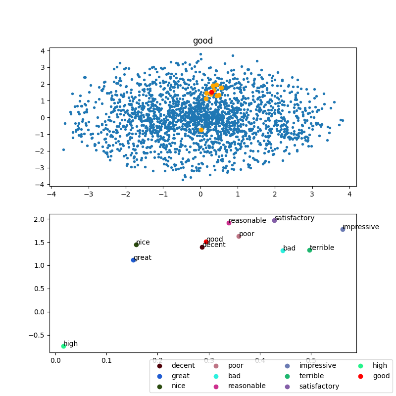
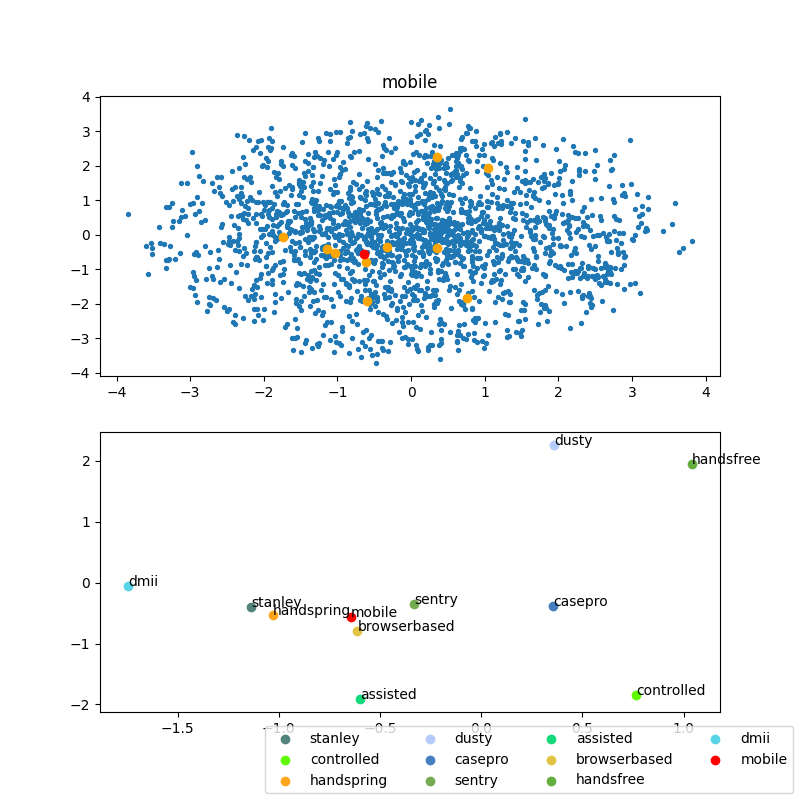
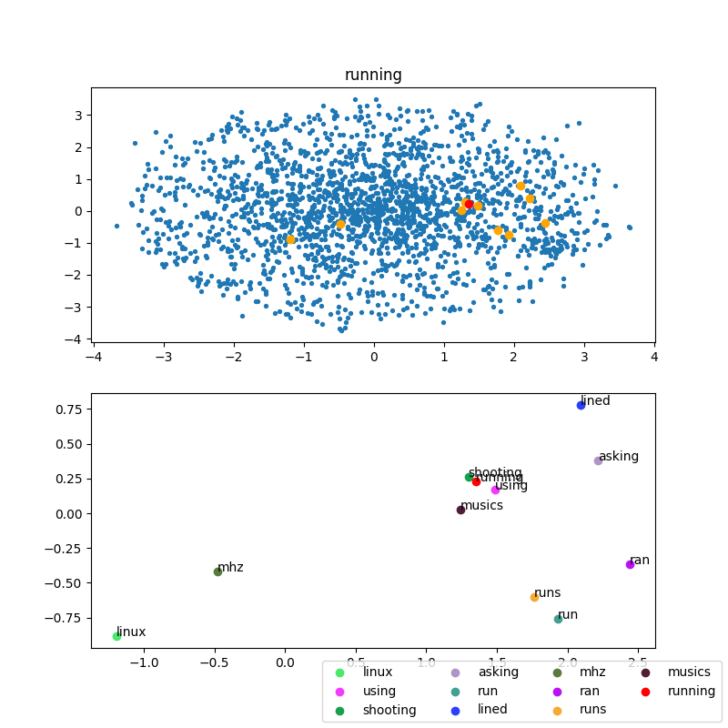
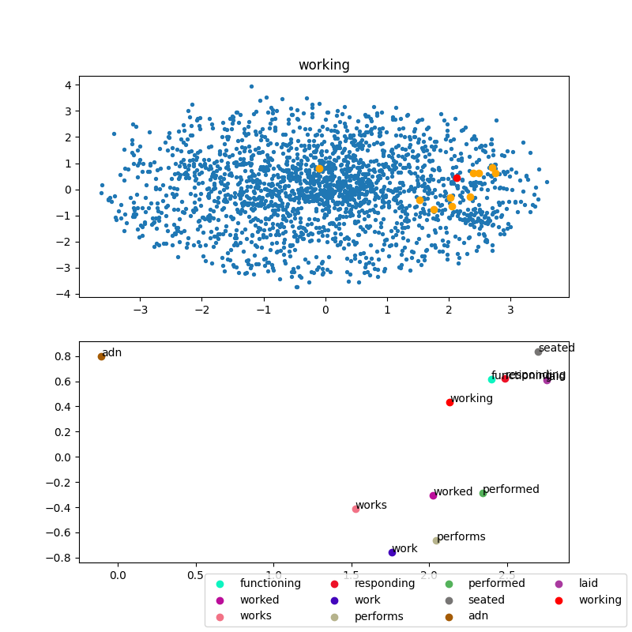

# ANLP A1 Report

## Details
### COM
 - embedding size: 64
 - window size: 3
 - dataset: full
 - no subsampling

### CBOW
 - embedding size: 128
 - window size: 2
 - dataset: first 5% of the reviews
 - no subsampling
 - optimizer: Adam
 - learning rate: 1e-3, decays to 10% on plateau

## t-SNE for top 10 words similar to a given word
### COM






### CBOW






## closest words to "camera"
### gensim
```
[(0.8131939172744751, 'cameras'),
 (0.7311819791793823, 'Wagging_finger'),
 (0.7250816822052002, 'camera_lens'),
 (0.7037474513053894, 'camcorder'),
 (0.6848659515380859, 'Camera'),
 (0.6474252939224243, 'Canon_digital_SLR'),
 (0.6350969076156616, 'Cameras'),
 (0.6259366273880005, 'Nikon_D####_digital_SLR'),
 (0.6189837455749512, 'tripod'),
 (0.6173486709594727, 'EyeToy_USB')]
```

### COM
```
[(0.8928911848385772, 'detector'),
 (0.8821579567780701, 'cam'),
 (0.8815108287096804, 'lens'),
 (0.8593728484445263, 'headset'),
 (0.8529955116182371, 'hu'),
 (0.8523488604043982, 'scope'),
 (0.8420577289835155, 'projector'),
 (0.8200729000802807, 'lense'),
 (0.8199327513022866, 'dolly'),
 (0.8140820959055732, 'gps')]
```

### CBOW
```
[(0.55826455, 'cameras'),
 (0.49113545, 'camcorder'),
 (0.39010555, 'gadget'),
 (0.3787037, 'gizmo'),
 (0.37331113, 'western'),
 (0.3663671, 'slr'),
 (0.36172682, 'unit'),
 (0.36006325, 'rebel'),
 (0.33836195, 'carryon'),
 (0.33446622, 'zoom')]
```

Clearly, the `gensim` similar words seem more relevant, which is obvious since they have been trained on a much bigger dataset.

We do see relevant words pop up in both the results for `COM` and `CBOW`, like "detector", "cam", "lens", "headset", "gizmo", "slr", "zoom", etc. Most of the words do make sense and can't be classified as wrong.

One interesting thing to note about `gensim` is that it is case sensitive and it reported "Camera" as one of the similar words.
